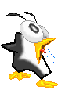

# Actores

Los actores son una pieza clave de pilas, nos sirven para representar
a los personajes dentro de videojuego, con sus propios atributos, apariencia
y comportamiento.

Puedes utilizar los actores prediseñados de pilas, o crear tus propios
actores. Existe una página separada del manual que explica [como crear tus
propios actores](/actores_personalizados/index.html), en lugar de utilizar los incluidos en pilas.


## Galería de actores incluídos

Hay varios actores pre-diseñados incluidos en pilas, podés usarlos
siguiendo los ejemplos de esta página o adaptarlos para crear los
tuyos propios:

  - [Actor](#actor)
  - [Aceituna](#aceituna)
  - [Animacion](#animacion)
  - [Animado](#animado)
  - [Bala](#bala)
  - [Banana](#banana)

### Actor

Representa un objeto visible en pantalla, algo que se ve y tiene
la estructura inicial de actor


Un objeto Actor se tiene que crear siempre indicando una imagen. Si no
se especifica una imagen, se verán los signos de interrogación de
color rojo.

Una forma de crear el actor con una imagen es:

    protagonista = Actor("planeta_azul.png")

incluso, es equivalente hacer lo siguiente:

    imagen = pilas.imagenes.cargar("planeta_azul.png")
    protagonista = Actor(imagen)

El resultado será:


Luego, una vez que ha sido ejecutada la sentencia aparecerá
el nuevo actor para que puedas manipularlo. Por ejemplo
alterando sus propiedades:

    protagonista.x = 100
    protagonista.escala = 2
    protagonista.rotacion = 30

Estas propiedades también se pueden manipular mediante
interpolaciones. Por ejemplo, para aumentar el tamaño del
personaje de 1 a 5 en 7 segundos:

    protagonista.escala = 1
    protagonista.escala = [5], 7

Si quieres que el actor sea invisible, un truco es crearlo
con la imagen ``invisible.png``:

    invisible = pilas.actores.Actor('invisible.png')


### Aceituna

El actor aceituna es super simple


    aceituna = pilas.actores.Aceituna()

*Métodos:*

- ``aceituna.saludar(mensaje)``
- ``aceituna.saltar()``


### Animacion

Representa una animación de una grilla de imágenes.

Este actor toma una grilla de cuadros de animación
y los reproduce hasta que la animación termina. Cuando
la animación termina se elimina a si mismo.

El constructor tiene algunos parámetros de utilidad:

- El parámetro ``ciclica`` permite hacer animaciones infinitas,
que se repiten siempre, por defecto vale ``False`` que significa que
la animación terminará y no se repetirá.
- El parámetro ``velocidad`` tiene que ser un número que indicará la
cantidad de cuadros por segundo que se tienen que mostrar
en la animación.

Por ejemplo, para mostrar una explosión infinita podrías escribir:

```
grilla = pilas.imagenes.cargar_grilla("explosion.png", 7)
animacion = pilas.actores.Animacion(grilla, ciclica=True, velocidad=1)
```


*Métodos:*

- ``animacion.saludar(grilla=None, ciclica=False, x=0, y=0, velocidad=10)``
- ``animacion.definir_velocidad_de_animacion(velocidad_de_animacion)``
- ``animacion.obtener_velocidad_de_animacion()``


### Animado

Representa un actor que tiene asociada una grilla con cuadros de animacion.

Una de las variantes que introduce este actor es el
método 'definir_cuadro', que facilita la animación de personajes.

Por ejemplo, si tenemos una grilla con un pingüino, podríamos
mostrarlo usando este código:

```
grilla = pilas.imagenes.cargar_grilla("pingu.png", 10)
actor = Animado(grilla)
actor.definir_cuadro(2)
actor.definir_cuadro(5)
```



*Métodos:*

- ``actor.definir_cuadro(indice)``


### Bala

Representa un disparo que avanza en linea recta, con un ángulo
de dirección y un sentido determinado.

```
bala = pilas.actores.Bala(rotacion=0, velocidad_maxima=9, angulo_de_movimiento=90)
```


y opcionalmente, si queremos que se llame a una función en el momento
de eliminación del disparo podemos hacer así:


```
bala.cuando_se_elimina = funcion_a_invocar
```

### Banana

Muestra una banana que se combina (temáticamente) con el actor Mono.


Este actor se podría usar cómo alimento o bonus para otros
actores.

Este actor tiene solo dos cuadros de animación que se pueden
mostrar con los métodos ``abrir`` y ``cerrar``:

```
banana = pilas.actores.Banana()
banana.abrir()
banana.cerrar()
```


*Métodos:*

- ``banana.abrir()``
- ``banana.cerrar()``
