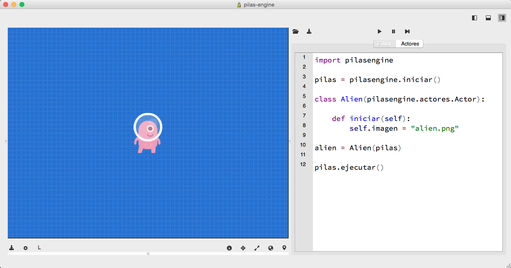
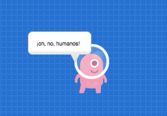
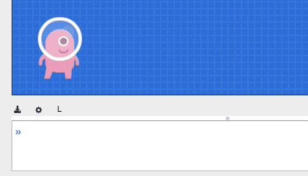

# Actores personalizados

Cuando tu juego crece, comienza la necesidad de crear
tus propios actores, darles personalidad y lograr
funcionalidad personalizada.

Esta página describe como crear tus propios actores
usando imágenes y algunos comportamientos propios.

## Creando una clase

El primer paso para crear un actor personalizado
es construir una clase para agrupar toda la funcionalidad
esperada.

Comencemos con una imagen sencilla para el
actor, este archivo se llama ``alien.png`` y está
en el directorio de nuestro código:


Luego, es momento de crear el código de la clase para
agrupar todo lo relacionado a este nuevo actor. Por
ejemplo con un código así:


```
import pilasengine

class Alien(pilasengine.actores.Actor):

    def iniciar(self):
        self.imagen = "alien.png"
```

## Mostrando el actor en la pantalla

Meditante la clase solamente hemos creado la "definición"
del actor, pero no lo hemos incorporado en el juego
aún.

El siguiente paso es incorporarlo al juego usando
la sentencia:

```
alien = Alien(pilas)
```

Ahora con el código completo, tendrías que ver al personaje
en el centro de la pantalla:




## Comportamiento heredado

Algo interesante de los nuevos actores es que incorporan
por herencia lo que saben hacer casi todos los actores
de ``pilas``, ya que le hemos indicado que heredará
de clase actor con la linea ``class Alien(pilasengine.actores.Actor):``.


Por ejemplo, podrías escribir algo como:

    alien.decir(u"¡oh, no, humanos!")





## Creando métodos nuevos


Ten en cuenta que ahora con nuestra nueva
clase podemos crear funcionalidad nueva y específica
para este actor alien.

Solo tenemos que tener precaución de dirigirnos al
actor como ``self`` dentro de los métodos. Por ejemplo,
si quiero crear un método para saludar puedo escribir:


```
import pilasengine

class Alien(pilasengine.actores.Actor):

    def iniciar(self):
        self.imagen = "alien.png"

    def saludar(self):
        self.decir("Hola mundo!!!, soy el nuevo actor alien")

    def dar_vuelta(self):
        self.rotacion = [360]
```


Y ahora tenemos dos métodos nuevos para invocar:

    alien.saludar()


y otro un poquito mas complejo:

    alien.dar_vuelta()





## El método especial "actualizar"


Una de las cosas mas importantes de la clase actor
es que incorpora un método especial llamado ``actualizar``. Este método se llamará automáticamente
60 veces por segundo.


Por ejemplo, imagina que buscamos hacer que el
actor se mueva para los costados usando las flechas
del teclado, podemos usar esté método, simplemente
así:


```
class Alien(pilasengine.actores.Actor):

    def iniciar(self):
        self.imagen = "alien.png"

    def saludar(self):
        self.decir("Hola mundo!!!, soy el nuevo actor alien")

    def dar_vuelta(self):
        self.rotacion = [360]

    def actualizar(self):
        if pilas.control.izquierda:
            self.x -= 5
            self.espejado = True
        if pilas.control.derecha:
            self.x += 5
            self.espejado = False
```


Es decir, como el método actualizar se llama casi
todo el tiempo, podemos usarlo para consultar
el estado del teclado y hacer algo.

En este caso, si se pulsa hacia la izquierda movemos
el actor un poquito a la izquierda (con ``self.x -= 5``)
y además invertimos el gráfico del actor para que mire a la
izquierda (con ``self.espejado = True``). Y claro, hacemos lo
opuesto para el lado
derecho.

Así se ve mientras voy pulsando las teclas ``izquierda``
y ``derecha``:


## Leyendo el código de otros actores

Pilas viene con una función especial llamada
``pilas.ver``, que te permite ver el código de
cualquier objeto y conocer su funcionamiento.

Esta función es super útil para conocer el código
de otras clases actor, e incluso aprender algunas
ideas interesantes.

Estos son algunos ejemplos de invocación, cada
una de estas sentencias te mostrará el código
de la clase completa:

```python
pilas.ver(pilasengine.actores.Mono)
pilas.ver(pilasengine.actores.Aceituna)
pilas.ver(pilasengine.actores.Pacman)
pilas.ver(mono)
```

## Parametros iniciales para los actores

Existen varios casos en donde queremos crear actores
pero especificando algunos parametros iniciales, como
la posición, energia o cualquier otro valor
externo a la clase.

Para estos parámetros podemos crear argumentos personalizados
en la clase nueva, por ejemplo, si quieres crear al actor
``Alien`` (que tomamos de ejemplo aquí) pero quieres especificarle
energia, podrías escribir:

```
alien = Alien(pilas, energia=100, nombre="pepe alien", con_sombra=True)
```

Y atender esos argumentos desde el método iniciar:


```python
class Alien(pilasengine.actores.Actor):

    def iniciar(self, energia, nombre, con_sombra):
        self.imagen = "alien.png"

        self.nombre = nombre
        self.energia = energia

        if con_sombra:
            self.sombra = pilas.actores.Sombra()
            self.sombra.escala = 0.6
            self.sombra.y = -45
        else:
            self.sombra = None

        self.decir("Hola, me llamo " + nombre)

    def actualizar(self):
        # Si el actor tiene sombra, hacemos que siga al
        # actor.
        if self.sombra:
            self.sombra.x = self.x
            self.sombra.y = self.y -45
```

Y el resultado debería quedarte así:


## Detectando errores y problemas al inicializar

Es muy importante que al momento de crear actores a partir
de clases especifiques los argumentos a utilizar. Hemos incluído
algo de código especial en **pilas** para detectar errores comunes, como
argumentos faltantes o incorrectos.

Pero aún así, ten en cuenta que todo argumento que le envíes
a un actor al crearlo tiene que estar declarado como argumento
en el método ``iniciar``.

Por ejemplo, un mensaje de error habitual que mostrará pilas si olvidamos
el nombre de los argumentos podría ser:

```
× TypeError: No se puede llamar al metodo 'iniciar' de la clase 'Alien'.
×    Faltan 3 argumentos: energia, nombre, con_sombra.
×    El método 'iniciar' espera estos 3 argumentos: ['energia', 'nombre', 'con_sombra']
```

Esto significa que hemos querido crear un actor a partir de una clase
que espera 3 argumentos, pero solo hemos llamado incorrectamente.

Regresando a nuestro ejemplo anterior, esto produciría un error:

```
alien = Alien(pilas)
```

mientras que este otro ejemplo sí funcionará, porque el método
``iniciar`` de la clase ``Alien`` espera los argumentos ``energia``, ``nombre`` y
``con_sombra``:

```
alien = Alien(pilas, energia=100, nombre="pepe alien", con_sombra=True))
```
