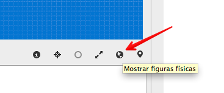
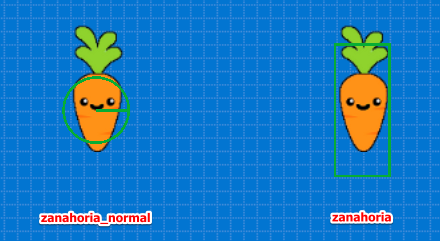

# Colisiones Físicas

Las colisiones te permite disparar acciones cuando dos o mas actores
entran en contacto. Esto nos permite hacer que los personajes puedan
chocar con enemigos o capturar objetos.


## Dos tipos de colisiones

En pilas-engine tenemos dos tipos de colisiones, hay
colisiones físicas y colisiones programadas.

Las **colisiones físicas** son aquellas que generan una reacción que se puede
visualizar como una respuesta física, por ejemplo si creamos 5 cajas y las
hacemos rebotar entre sí, estas serían colisiones físicas:


```
cajas = pilas.actores.Caja() * 5
```

Podríamos decir que las colisiones físicas son casi automáticas, las genera
el mismo motor de física que trae pilas-engine sin mucho código.

En cambio, las **colisiones programadas** son aquellas que tienen una reacción
por código, y generalmente tienen que ver con la lógica del juego (perder, ganar
puntos, pasar de nivel etc..)

Por ejemplo, una colisión programada sencilla se puede visualizar si creamos
un personaje que se pueda mover con el mouse y se alimente comiendo bananas:


```
mono = pilas.actores.Mono()
mono.aprender(pilas.habilidades.Arrastrable)
bananas = pilas.actores.Banana() * 10

def cuando_colisiona(mono, banana):
    banana.eliminar()
    mono.sonreir()

pilas.colisiones.agregar(mono, bananas, cuando_colisiona)
```

## Modo depuración física

El modo depuración física nos permite observar las figuras físicas de
cada uno de los actores. Para activar este modo, podés pulsar la tecla **F12**
o simplemente hacer click sobre el ícono "mostrar figuras físicas":




Con este modo habilitado, vas a poder observar la figura de colisión
que lo representa:


En color blanco aparecen las figuras físicas, que al rebotar con otras
producirán una reacción de choque y rebote. Y de color verde van a aparecer
los sensores.


Los sensores son figuras físcias pero que no generan una reacción
al momento del choque.


## Acceder a las figuras de colisión

En muchos momentos vas a necesitar hacer ajustes sobre las figuras
de colisión. Lo mas común es cambiar el tamaño de las figuras (para ajustarlas
  al tamaño del actor) o convertir las figuras a sensores.


Para acceder a las figuras de colisión tienes que usar el atributo
`figura_de_colisión` del actor, o bien cambiar su tamaño directamente
cambiando el atributo ``radio_de_colisión`` por ejemplo:


```
mono = pilas.actores.Mono()
mono.radio_de_colision = 30
mono.radio_de_colision = 80
mono.radio_de_colision = 10
```

Cada vez que asignes un valor al atributo `radio_de_colision`, pilas va a
generar una circunferencia y la va a colocar como figura de colisión para el
actor.


## Cambiando las figuras de colisión

En la mayoría de los casos la figura circular es la que mejor se ajusta
al area de un actor.

Sin embargo, hay algunos casos en donde necesitamos cambiar completamente
la figura de colisión por otra.

La forma mas sencilla de cambiar una figura por otra, es crear la figura
física primero y luego asignarla a la propiedad `figura_de_colision` del
actor:



Para construir este ejemplo construímos dos actores, al primero lo dejamos
tal cual, pero al segundo le cambiamos la figura de colisión por un rectángulo:

```
zanahoria_normal = pilas.actores.Zanahoria(x=-100)

zanahoria = pilas.actores.Zanahoria(x=100)
rectangulo = pilas.fisica.Rectangulo(0, 0, 40, 100, sensor=True)
zanahoria.figura_de_colision = rectangulo
```


## Colisiones con etiquetas

Ten en cuenta que existe un atajo para definir colisiones
usando el concepto de etiquetas, que se verá en la siguiente
página de este manual.

