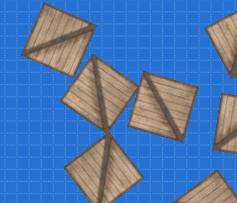
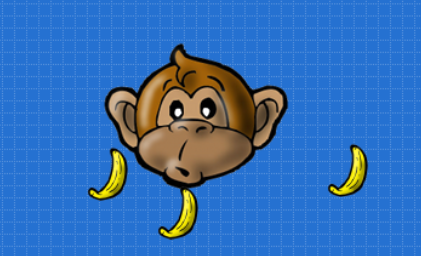
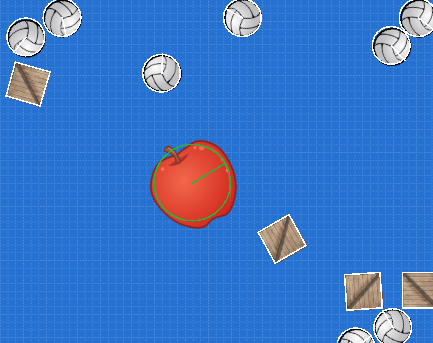
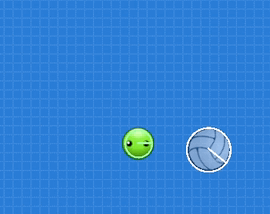
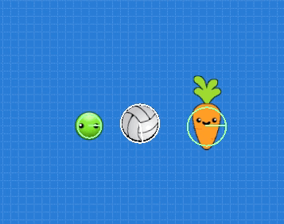

# Colisiones Físicas

El sistema de colisiones te permite disparar acciones cuando dos o más actores
entran en contacto. Esto nos permite hacer que los personajes puedan
chocar con enemigos, capturar objetos y mucho más.


## Dos tipos de colisiones

En pilas-engine tenemos dos tipos de colisiones: colisiones
físicas y colisiones programadas.

Las **colisiones físicas** son aquellas que generan una reacción que se puede
visualizar como una respuesta física, por ejemplo si creamos 5 cajas y las
hacemos rebotar entre sí, estas serían colisiones físicas:



```python
cajas = pilas.actores.Caja() * 5
```

Podríamos decir que las colisiones físicas son casi automáticas, las genera
el mismo motor de física que trae pilas-engine sin mucho código.

En cambio, las **colisiones programadas** son aquellas que tienen una reacción
por código, y generalmente tienen que ver con la lógica del juego (perder, ganar
puntos, pasar de nivel etc..)

Por ejemplo, una colisión programada sencilla se puede visualizar si creamos
un personaje que se pueda mover con el mouse y se alimente comiendo bananas:



```python
mono = pilas.actores.Mono()
mono.aprender("Arrastrable")
bananas = pilas.actores.Banana() * 10

def cuando_colisiona(mono, banana):
    banana.eliminar()
    mono.sonreir()

pilas.colisiones.agregar(mono, bananas, cuando_colisiona)
```

## Modo depuración física

El modo depuración física nos permite observar las figuras físicas de
cada uno de los actores. Para activar este modo, podés pulsar la tecla **F12**
o simplemente hacer click sobre el ícono "mostrar figuras físicas":


Con este modo habilitado, vas a poder observar la figura de colisión
que lo representa:



En color blanco aparecen las figuras físicas, que al rebotar con otras
producirán una reacción de choque y rebote. Y de color verde van a aparecer
los sensores.


Los sensores son figuras físcias pero que no generan una reacción
al momento del choque.


## Acceder a las figuras de colisión

En muchos momentos vas a necesitar hacer ajustes sobre las figuras
de colisión. Lo mas común es cambiar el tamaño de las figuras (para ajustarlas
  al tamaño del actor) o convertir las figuras a sensores.


Para acceder a las figuras de colisión tienes que usar el atributo
`figura_de_colisión` del actor, o bien cambiar su tamaño directamente
cambiando el atributo ``radio_de_colisión`` por ejemplo:


```python
mono = pilas.actores.Mono()
mono.radio_de_colision = 30
mono.radio_de_colision = 80
mono.radio_de_colision = 10
```

Cada vez que asignes un valor al atributo `radio_de_colision`, pilas va a
generar una circunferencia y la va a colocar como figura de colisión para el
actor.


## Cambiando las figuras de colisión

En la mayoría de los casos la figura circular es la que mejor se ajusta
al area de un actor.

Sin embargo, hay algunos casos en donde necesitamos cambiar completamente
la figura de colisión por otra.

La forma mas sencilla de cambiar una figura por otra, es crear la figura
física primero y luego asignarla a la propiedad `figura_de_colision` del
actor:


Para construir este ejemplo construímos dos actores, al primero lo dejamos
tal cual, pero al segundo le cambiamos la figura de colisión por un rectángulo:

```python
zanahoria_normal = pilas.actores.Zanahoria(x=-100)

zanahoria = pilas.actores.Zanahoria(x=100)
rectangulo = pilas.fisica.Rectangulo(0, 0, 40, 100, sensor=True, dinamica=False)
zanahoria.figura_de_colision = rectangulo
```

## Detección constante de colisiones

Pilas también incluye un forma constante de detectar colisiones, algo que
puede ser mucho más sencillo de implementar en juegos de acción.

Cada figura física tiene una propiedad llamada `figuras_en_contacto` con
una lista de todas las figuras con las que colisiona.

Por ejemplo, tomemos de ejemplo un actor "Pelota". Si queremos consultar
si el actor Pelota está colisionando con alguna figura podemos ejecutar:

```
>> pelota = pilas.actores.Pelota()
>> print(pelota.figura_de_colision.figuras_en_contacto)
```

Si el actor no colisiona con nada, se nos retornará una lista vacía:

```
[]
```

En cambio, si el actor está en colisión con alguna figura, la lista
que se retornará contendrá al menos un elemento:

```
[<Figura Rectangulo en (0, -240)>]
```


Este tipo de colisiones constantes son super útiles cuando creamos
actores personalizados (como se indica en el apartado
[Actores personalizados](actores_personalizados.md)), ya que desde el método
actualizar vamos a poder comprobar colisiones constantemente.

Por ejemplo, para emitir un mensaje cada vez que se produce una colisión
podríamos escribir un código como el siguiente:

```
indicador_de_colision = pilas.actores.Texto("HAY COLISION!", y=100)
indicador_de_colision.transparencia = 100

class PelotaTransparente(pilasengine.actores.Pelota):

    def iniciar(self):
        pilasengine.actores.Pelota.iniciar(self)
        self.aprender('arrastrable')

    def actualizar(self):

        if self.figura_de_colision.figuras_en_contacto:
            self.transparencia = 0
            indicador_de_colision.transparencia = 0
        else:
            self.transparencia = 50
            indicador_de_colision.transparencia = 100

pilas.actores.vincular(PelotaTransparente)
pilas.actores.PelotaTransparente()

pilas.actores.Aceituna()
```





Eso sí, ten en cuenta que la lista de `figuras_en_contacto` no es una
referencia a los actores, sino la lista de figuras. Si lo que quieres es
obtener información de los actores tendrías que usar el atributo
`actor_que_representa_como_area_de_colision` de la figura.

Por ejemplo, podemos cambiar el código que maneja la colisión para
que indique si el actor que colisiona es aceituna o no:





```
indicador_de_colision = pilas.actores.Texto("HAY COLISION!", y=100)
indicador_de_colision.transparencia = 100

def es_aceituna(actor):
    return 'aceituna' in actor.etiquetas.lista

class PelotaTransparente(pilasengine.actores.Pelota):

    def iniciar(self):
        pilasengine.actores.Pelota.iniciar(self)
        self.aprender('arrastrable')

    def actualizar(self):
        figura = self.figura_de_colision.figuras_en_contacto

        if figura:
            indicador_de_colision.transparencia = 0
            self.cambiar_texto(figura[0])
        else:
            indicador_de_colision.transparencia = 100

    def cambiar_texto(self, figura):
        actor = getattr(figura, "actor_que_representa_como_area_de_colision", None)

        if actor:
            # Ha colisionado con una figura que tiene un actor enlazado.
            if es_aceituna(actor):
                indicador_de_colision.texto = "Colisiona con actor aceituna."
            else:
                indicador_de_colision.texto = "Colisiona con Actor, no es Aceituna!!!"


pilas.actores.vincular(PelotaTransparente)
pilas.actores.PelotaTransparente()

pilas.actores.Aceituna()
pilas.actores.Zanahoria(x=150)
```


## Colisiones con etiquetas

Ten en cuenta que existe un atajo para definir colisiones
usando el concepto de etiquetas, que se verá en la siguiente
página de este manual.
