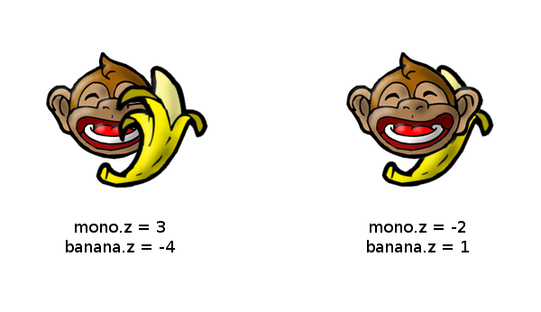

# Controlando la pantalla

Para posicionar actores en el escenario
principal es importante conocer las
propiedades de la pantalla.

La pantalla es lo que contiene la ventana
principal de pilas, y que puede observar
una porción del escenario y a un grupo de actores.

## Modo depuración

El modo depuración te permite ver información
de utilidad cuando estás desarrollando un juego
o simplemente buscando algún error.

Para iniciar el modo depuración pulsa **F12**. En
la ventana principal aparecerán varios textos
indicando el rendimiento del juego, las coordenadas
de posición de los actores y la posición del
mouse.

El centro de la ventana es, inicialmente, el
punto ``(0, 0)``. Este modelo de coordenadas
es el cartesiano, y lo hemos elegido porque es
el que mejor se adapta a los conocimientos
geométricos que se enseñan en las escuelas.

## Orden de impresión: atributo z

Cuando tienes varios actores en pantalla notaras
que a veces unos aparecen sobre otros.

Para cambiar este comportamiento tienes que modificar
el atributo ``z`` de cada actor.

Los valores altos de ``z`` indican mucha distancia
entre el observador y el escenario. Mientras que
valores pequeños ``z`` harán que los actores tapen
a los demás (porque aparecerán mas cerca del
usuario).

Este es un ejemplo de dos configuraciones distintas
de atributos ``z``:

Ten en cuenta que inicialmente todos los actores
tienen un atributo ``z=0``.

## Atributos de posición

Todos los actores tienen atributos cómo:

- ``x``
- ``y``

que sirven para cambiar la posición del actor dentro de la escena.

También encontrarás atributos que permiten hacer lo mismo, pero
tomando como referencia alguno de los bordes del
actor. Por ejemplo:

- ``izquierda``
- ``derecha``
- ``arriba``
- ``abajo``

Ten en cuenta que estos valores indicarán la posición del
actor dentro del escenario, no de la ventana. Esto significa que
si cambias la posición de la cámara los actores seguirán estando
en la misma posición pero se verán un poco corridos.
