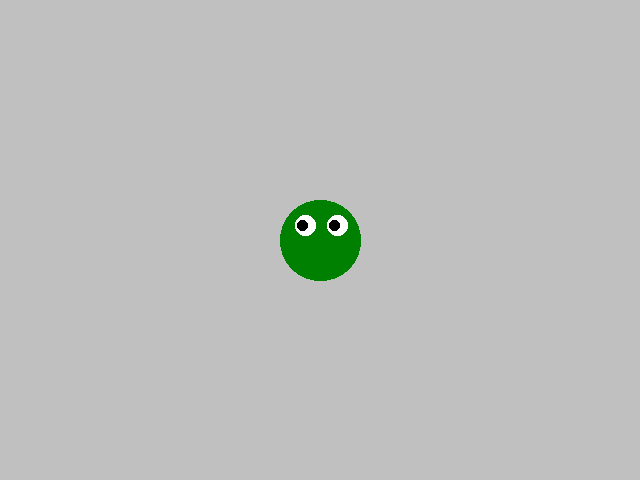

# Dibujado avanzado con Superficies

Anteriormente vimos que los actores podían
tener un aspecto visual, ya sea gracias a
una imagen completa, una grilla o un dibujo
de pizarra.

Pero hay situaciones donde realmente necesitamos
algo mas. En muchas ocasiones necesitamos que
los actores puedan tener una apariencia que
construimos programáticamente (si existe la palabra...).

Por ejemplo, imagina que queremos hacer un indicador
de energía, un cronómetro, un indicador de vidas, un
botón etc...

## Dibujando sobre superficies

En pilas una superficie es una imagen, pero que no
se carga directamente desde el disco, sino que se
construye en memoria de la computadora, se puede
dibujar sobre ella y luego se le puede aplicar
a un actor como apariencia.

Comencemos con un ejemplo sencillo, imagina que
queremos hacer un actor muy feo, de color "verde"
y con dos ojitos. Lo primero que tenemos que hacer
es crear una superficie, dibujar sobre ella, y luego
crear un actor con esa apariencia:

    import pilas

    pilas.iniciar()

    superficie = pilas.imagenes.cargar_superficie(100, 100)

    # dibujamos el cuerpo
    superficie.circulo(50, 50, 40, color=pilas.colores.verdeoscuro, relleno=True)

    # un ojo
    superficie.circulo(35, 35, 10, color=pilas.colores.blanco, relleno=True)
    superficie.circulo(32, 35, 5, color=pilas.colores.negro, relleno=True)

    # el otro ojo
    superficie.circulo(67, 35, 10, color=pilas.colores.blanco, relleno=True)
    superficie.circulo(64, 35, 5, color=pilas.colores.negro, relleno=True)

    pilas.actores.Actor(superficie)

    pilas.ejecutar() # Necesario al ejecutar en scripts.

Es decir, una vez que creamos la superficie, en realidad lo que obtenemos
es un objeto que se comporta cómo una imagen, pero con la diferencia
que podemos dibujar sobre ella libremente y crear desde el código la
imagen que queramos:

Ten en cuenta que también estamos mostrando la superficie gracias a un
actor, así que si rotamos el actor o cambiamos su escala la superficie
se observará de forma transformada.

Vamos a ver con mas detalle este recurso de pilas, porque ofrece muchas
mas funcionalidades de las que vemos en este ejemplo.

## Creación de una superficie

Para crear una superficie tenemos que invocar a la función ``pilas.imagenes.cargar_superficie``
como vimos mas arriba. Esta función admite dos parámetros que indican
el ancho y el alto de la superficie.

A partir de ese momento, la superficie será completamente transparente, y lo
que dibujemos sobre ella hará que no se note que en realidad es
un rectángulo. Vale aclarar que efectivamente todas las imágenes de los videojuegos
son rectangulares aunque se disimule...

## Coordenadas de las superficies

Las coordenadas que se tienen que especificar para dibujar
sobre una superficie son diferentes a las coordenadas cartesianas
que usamos en la ventana de pilas.

El motivo de este cambio es que las superficies están en la memoria
de la computadora, y es mas sencillo tratar con ellas si usamos
el mismo sistema de coordenadas que se usa en casi todas las aplicaciones
gráficas. Ten en cuenta que estas son funciones avanzadas y
que generalmente se trabaja sobre estas funciones unas pocas veces
para lograr lo que ya no está implementado como un actor...

El sistema de coordenadas de las superficies tiene su origen
en la esquina superior izquierda ``(0, 0)``, luego el eje ``x`` crece
hacia la derecha y el eje ``y`` crece hacia abajo.

## Métodos para dibujar

### Pintar

Originalmente cuando creamos una superficie es completamente
transparente. Si queremos cambiar esto y pintar toda la superficie
de un color plano, podemos usar el siguiente método::

    superficie.pintar(color)

Donde el argumento color puede ser algo cómo ``pilas.colores.rojo`` o
un color personalizado indicando las componentes de color
``rojo``, ``verde`` y ``azul``. Por ejemplo::

    superficie.pintar(pilas.colores.Color(100, 255, 0))

### Circulo

Para pintar círculos podemos usar el método ``circulo``. Indicando la
posición del círculo, su radio y el color.

Ten en cuenta que también debemos indicar si queremos un círculo completamente
sólido y pintado o solamente un borde.

Esta es la definición del método:

    def circulo(self, x, y, radio, color=colores.negro, relleno=False, grosor=1):

Si invocamos a la función solamente con sus argumentos principales, obtendremos
una silueta de circunferencia sin relleno, por ejemplo::

    figura.circulo(50, 50, 100)

o si queremos un trazo mas grueso:

    figura.circulo(50, 50, 100, grosor=5)

aunque también podemos indicarle que la circunferencia tiene que
estar pintada y con otro color:

    figura.circulo(50, 50, 100, pilas.colores.rojo, relleno=True)

### Rectángulo

El dibujo de rectángulos es muy similar al de círculos, solo que aquí
tenemos que indicar la coordenada de la esquina superior izquierda
del rectángulo y el tamaño, en ancho y alto.

Esta es la definición del método:

    def rectangulo(self, x, y, ancho, alto, color=colores.negro, relleno=False, grosor=1):

### Linea

Una linea se compone obligatoriamente de puntos, los que marcan el
principio y el final de la linea. Para esto se tienen que usar
4 números, dos para cada punto.

Por ejemplo, el siguiente código dibuja una linea diagonal
de color rojo y con 3 píxeles de grosor:

    superficie.linea(20, 20, 50, 50, pilas.colores.rojo, 3)

### Texto

El dibujo de texto se realiza siempre a partir de una cadena
de texto. Y opcionalmente se pueden especificar otros
parámetros cómo la posición del texto, el color, el tamaño de
las letras y la tipografía.

Este es un ejemplo sencillo que imprime un texto de color
azul:

    superficie.texto("Hola mundo", magnitud=20, fuente="Courrier", color=pilas.colores.azul)

Ten en cuenta que la fuente se indica como una cadena, y
el valor que podemos poner ahí es el de cualquiera de nuestras
fuentes del sistema. Si nuestro sistema no tiene la fuente que le
solicitamos, se imprimirá usando una tipografía por defecto.
