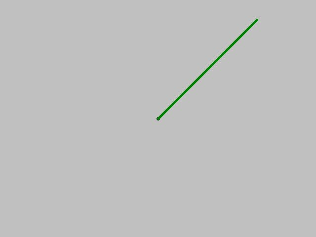
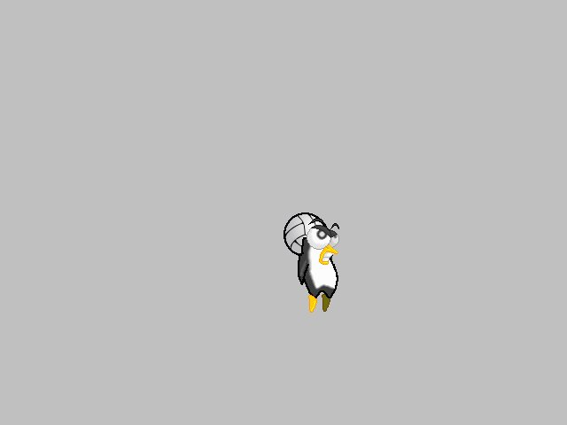

# Dibujado simple en pantalla

Hasta ahora hemos mostrado en la pantalla
fondos y actores que originalmente estaban
almacenados en el disco de la computadora
cómo imágenes.

En esta sección veremos como dibujar libremente, ya
sean lineas, círculos, texto etc..

Comenzaremos con una forma de dibujado muy
sencilla, y luego veremos algunas alternativas
que ofrecen mas flexibilidad.

Ten en cuenta que el dibujo avanzado y mas flexible
lo vamos a ver en el siguiente capítulo **Dibujo avanzado
con Superficies**.


## Usando la Tortuga para dibujar

El actor ``Tortuga`` está inspirado en una de
las actividades mas divertidas, didácticas y simbólicas
del lenguaje de programación **logo**, creado
por **Seymour Papert**.

La ``Tortuga`` básicamente es un actor que sabe
dibujar sobre la ventana de pilas. Para ello el
programador tiene que indicarle a la tortuga qué
movimiento debe realizar.

La siguiente imagen muestra lo que podría
dibujar la tortuga con algunas sentencias de
movimientos:


La imagen no alcanza a mostrar por completo el
concepto, pero en pocas palabras se puede sintetizar
lo que realmente hace.

El dibujo de la imagen anterior es una traza que
va dibujando la tortuga a partir de su movimiento.

El siguiente código es el que se utilizó para
dibujar esa linea de dos colores:


```python
import pilasengine

pilas = pilasengine.iniciar()

tortuga = pilas.actores.Tortuga()
tortuga.avanzar(30)
tortuga.color = pilas.colores.azul
tortuga.avanzar(200)
```


Algo muy valioso en términos didácticos, es que
uno podría animarse a realizar dibujos simples cómo
una casa, un hexágono o cualquier otra figura diseñando una estrategia
de movimiento para la tortuga.

## Inspeccionando a la tortuga

Para manejar a este actor tienes varios comandos
inspirados en logo.

Esta es una lista de los comandos mas utilizados:


Método completo  | nombre corto | ejemplo                                | ¿que hace?
---------------- | ------------ | -------------------------------------- | -----------------------------------------------
avanzar          | av           | `tortuga.av(10)`                       | avanza en dirección a donde mira la tortuga.  
giraderecha      | gd           | `tortuga.gd(45)`                       | gira hacia la derecha los grados indicados.
giraizquierda    | gi           | `tortuga.gi(45)`                       | gira hacia la izquierda los grados indicados.  
subelapiz        | sl           | `tortuga.sl()`                         | deja de dibujar cuando se mueve la tortuga.
bajalapiz        | bl           | `tortuga.bl()`                         | comienza a dibujar cuando la tortuga se mueve.
pon_color        | pc           | `tortuga.pc(pilas.colores.rojo)`       | dibuja con el color indicado.
pintar           | pintar       | `tortuga.pintar(pilas.colores.blanco)` | pinta toda la pantala del mismo color.


Por supuesto hay algunos mas, pero esos quedan para
investigar en la clase propiamente dicha. Recuerda que
el auto-completado del intérprete de python es bastante
útil para estas cosas.

## Usando una Pizarra

Si quieres dibujar sobre la pantalla pero
de forma inmediata y con algunas posibilidades mas
elaboradas, puedes
usar un actor llamado ``Pizarra``. Esta no es la
forma mas avanzada, pero es el siguiente paso después
de dominar al actor ``Tortuga``.

Este actor ``Pizarra`` es cómo un lienzo invisible sobre
el que podemos pintar imágenes, figuras
geométricas y trazos de cualquier tipo. De hecho, el actor
``Tortuga`` que vimos antes, en realidad estaba
dibujando sobre una pizarra, solo que lo hacía con
animaciones y algo lento.

Comencemos con algo sencillo: para crear la pizarra y
dibujar un punto en el centro de la
pantalla se puede usar el siguiente
código:

```python
pizarra = pilas.actores.Pizarra()
pizarra.dibujar_punto(0, 0)
```

incluso podrías usar el argumento opcional ``color``
si prefieres otro color, o trazar una linea:

```python
pizarra.linea(0, 0, 200, 200, pilas.colores.verdeoscuro, grosor=5)
```




## Pintando imágenes

Las pizarras también pueden dibujar imágenes sobre la superficie,
y esto es útil cuando quieras crear pinceles especiales sobre
la pizarra o construir un escenario usando bloques tipo
ladrillos.

Para pintar una imagen solo tienes que cargarla e
indicarla a la pizarra que la dibuje en una posicion determinada.


    imagen = pilas.imagenes.cargar("pelota.png")
    pizarra.pintar_imagen(imagen, 0, 0)


Así se verá:


Ten en cuenta que en estos casos, cuando estamos dibujando
una imagen sobre otra, el punto destino (x, y) siempre indica
la esquina superior izquierda de la imagen, no el centro u
otra posición relativa como en el caso de los actores.

## Pintando porciones de imágenes

Hay ocasiones en las que te resultará útil poder
pintar solamente porciones de una imagen sobre otra. Para
estos casos está el método ``pintar_parte_de_imagen``.

Veamos la definición del método::


    def pintar_parte_de_imagen(self, imagen, origen_x, origen_y, ancho, alto, x, y):


## Dibujando grillas

De manera similar a las imágenes normales, sobre las pizarras
también se pueden pintar grillas.

Solamente tenemos que crear la grilla, seleccionar el
cuadro de animación y después decirle a la pizarra
que pinte el cuadro actual de la grilla:


    grilla = pilas.imagenes.cargar_grilla("pingu.png", 10)
    pizarra.pintar_grilla(grilla, 0, 0)


Así se verá:



Esto es útil cuando se quieren pintar bloques de un escenario
completo, por ejemplo podríamos tener una grilla con distintos
tipos de suelos (pasto, piedra, tierra) y luego ir
imprimiendo sobre una pizarra para formar un escenario completo.

## La pizarra como actor

Recuerda que la pizarra también es un actor, así que puedes enseñarle
habilidades, cambiar su posición, rotación o lo que quieras.
