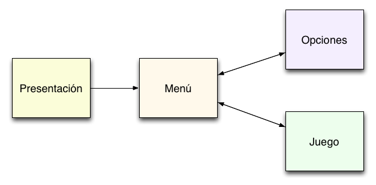
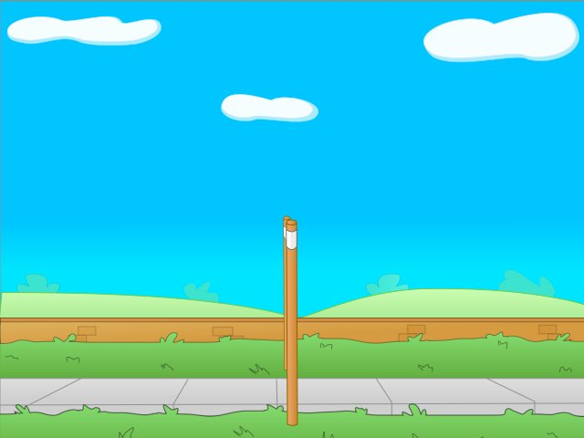
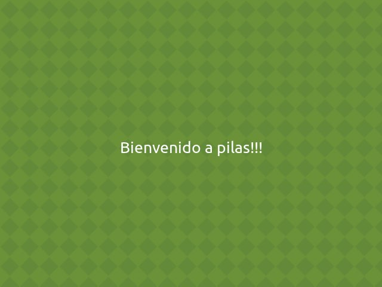

# Escenas

Las escenas te permiten dividir el juego en partes
reconocibles y que interactúan de manera diferente
con el usuario.

Un juego típico tendrá al menos una escena cómo
el menú principal, una presentanción y una
pantalla de juego.

## Cosas a tener en cuenta

Hay algunas cosas a tener en cuenta
a la hora de manejar escenas, porque
simplifican mucho el trabajo posterior:

- La escena actual siempre está señalada por el atributo ``pilas.escena_actual()``.
- Solo puede existir una escena activa a la vez.

## La escena Normal

Cuando iniciamos pilas por primera vez se creará
una escena llamada ``Normal``. Esta escena no
tiene un comportamiento muy elaborado, simplemente
imprime toda la pantalla de gris para que
podamos colocar actores sobre ella y veamos una
escena limpia.

## Pausando el juego

En cualquier momento del juego podemos ejecutar ``pilas.escena.pausar()``
y el juego quedará pausado hasta que se pulse la tecla ESC y vuelva a la
ejecución normal del juego.

Este comando es un atajo que carga la escena ``Pausa``.
Puedes crear tu propia pantalla de PAUSA heredando de ``pilas.escena.Pausa``.

## Cambiando el fondo de las escenas

Para hacer una pequeña prueba sobre una
escena, podrías ejecutar la siguiente sentencia
de código:

    pilas.fondos.Volley()

Esto le dará a tu escena una vista
mas agradable, porque carga un fondo de
pantalla colorido y mas divertido:

o podrías usar un fondo de atardecer:

    pilas.fondos.Tarde()

## Cómo crear nuevas escenas

Imagina que tienes un juego con dos pantallas, una
que simplemente dice "bienvenido" y  otra con
un personaje para mover.

Claramente tendríamos que hacer dos escenas, e iniciar
nuestro juego creando la escena principal.

La primer escena tendríamos que representarla
con una clase, que herede de la escena Normal
así:

    class PantallaBienvenida(pilas.escena.Normal):

        def __init__(self):
            pilas.escena.Normal.__init__(self)

        def iniciar(self):
            pilas.fondos.Pasto()
            texto = pilas.actores.Texto("Bienvenido a pilas!!!")

Ahora, para poner en funcionamiento esta escena
simplemente tienes que decirle a pilas que esta escena es la activa:

    pilas.cambiar_escena(PantallaBienvenida())

Esto eliminará las escenas almacenadas y se colocará como la escena
actual y activa:

Ahora, si quieres salir de la escena, simplemente tendrías
que hacer un objeto de otra clase que represente otra escena y llamar a uno de
estos tres metodos:

- pilas.cambiar_escena(mi_escena)
- pilas.almacenar_escena(mi_escena)
- pilas.recuperar_escena()

## Métodos que se pueden re-definir

Dentro de cada escena existen 2 métodos que pueden ser redefinidos.

    def pausar(self):
        pass

    def reanudar(self):
        pass

Si quieres tener el control de cuando una escena se queda apilada, deberás
redefinir el método:

    def pausar(self):
        pass

Si quieres sabes cuando una escena apilada vuelve a ser la escena activa,
deberás redefinir el método:

    def reanudar(self):
        pass

#  Como migrar mi juego al nuevo Gestor de Escenas

Antes de migrar tu juego al nuevo sistema de gestión de escenas, es mejor que
le des un vistazo a `gestor_de_escenas` para comprender mejor el
apilamiento de escenas.

Ahora pasamos a explicar los sencillos pasos a seguir para hacer la migración de tu juego.

## Iniciar el juego

Tu juego debe tener una estructura de inicio parecida a la siguiente:

import pilas
import escena_menu

pilas.iniciar(titulo='Mi titulo')

escena_menu.EscenaMenu()

pilas.ejecutar()

Lo único que deberás cambiar aquí es la línea que llama a la escena.
Tendrá que quedar de la siguiente forma:

import pilas
import escena_menu

pilas.iniciar(titulo='Mi titulo')

# Esta es la línea que debemos cambiar
pilas.cambiar_escena(escena_menu.EscenaMenu())

pilas.ejecutar()

## Escenas del juego

Todas las escenas de tu juego deben heredar ahora de `pilas.escena.Base`.

class MiEscena(pilas.escena.Base):

Y el otro cambio que debes realizar en las escenas es que el método ``__init__(self)`` no debe
contener nada más que la llamada al ``__init__`` de la escena Base

def __init__(self):
pilas.escena.Base.__init__(self)

Luego debes definir un método ``iniciar(self)`` donde podrás crear los
nuevos actores y lo necesario para iniciar tu escena.

def iniciar(self):
pilas.fondos.Pasto()
mono = pilas.actores.Mono()

Aquí un ejemplo de como debería ser el cambio.

**Escena antigua**

class MiEscena(pilas.escenas.Escena):

def __init__(self):
pilas.escenas.Escena.__init__(self)

pilas.fondos.Pasto()
mono = pilas.actores.Mono()

**Escena nueva**

class MiEscena(pilas.escena.Base):

def __init__(self):
pilas.escena.Base.__init__(self)

def iniciar(self):
pilas.fondos.Pasto()
mono = pilas.actores.Mono()

## Cambio de Escena

En algún punto de tu juego, llamarías a otra escena para cambiarla.

escena_juego.Escena_Juego()

Debes sustituir esta llamada a la nueva escena por esta otra forma:

pilas.cambiar_escena(escena_juego.Escena_Juego())

## Eventos

Ahora los eventos son individuales por cada escena.
Si quieres conectar a algún evento, como `mueve_mouse`, `actualizar`, `pulsa_tecla`, puedes
hacerlo de cualquiera de las dos siguientes formas:

def mi_metodo(evento):
# Hace algo

pilas.eventos.actualizar.conectar(mi_metodo())

# Otra forma de conectar
pilas.escena_actual().actualizar.conectar(mi_metodo())

Ambas formas conectan a los eventos de la escena actualmente activa.

Si deseas crear tu propio evento, lo deberás hacer de la siguiente forma:

pilas.eventos.mi_evento_personalizado = pilas.evento.Evento("mi_evento_personalizado")
pilas.eventos.mi_evento_personalizado.conectar(self._mi_evento_personalizado)

## Fin de la migración

Con estos simples pasos, tu juego debe funcionar sin problemas con el nuevo
sistema de gestión de escenas.

Ante cualquier problema no tengas dudas en ponerte en contacto con nosotros
mediante el [foro de pilas-engine](http://foro.pilas-engine.com.ar/).

# Nuevo Gestor de Escenas

Pilas contiene un nuevo gestor de escenas que permite tener más de una
escena en el juego, aunque sólo una de ellas será la activa.

Esta nueva funcionalidad nos permitiría, por ejemplo, estar jugando y en
cualquier momento pulsar una tecla y acceder a las opciones del juego.

Allí quitaríamos el sonido y luego pulsando otra tecla volveríamos al juego,
justo donde lo habíamos dejado.

Nuestros actores estarán en la misma posición y estado en el que los habíamos
dejado antes de ir a las opciones.

## Escena Base

Es la Escena de la cual deben heredar todas las escenas del juego en pilas.

pilas.escena.Base

El ``método antiguo`` para crear una escena era el siguiente:

class MiEscena(pilas.escenas.Escena):

def __init__(self):
pilas.escenas.Escena.__init__(self)

pilas.fondos.Pasto()
mono = pilas.actores.Mono()

Ahora el ``método nuevo`` para crear una escena es el siguiente:

class MiEscena(pilas.escena.Base):

def __init__(self):
pilas.escena.Base.__init__(self)

def iniciar(self):
pilas.fondos.Pasto()
mono = pilas.actores.Mono()

Como puedes observar, ahora la escena hereda de:

pilas.escena.Base

Otro cambio **muy importante** es que el metodo ``__init__(self)`` no debe
contener nada más que la llamada al ``__init__`` de la escena Base.

def __init__(self, titulo):
pilas.escena.Base.__init__(self)

self._titulo = titulo
self._puntuacion = puntuacion

Puedes almacenar unicamente parámetros que quieras pasar a la escena.
Por ejemplo así:

def __init__(self, titulo):
pilas.escena.Base.__init__(self)

self._titulo = titulo

Y por último debes definir un método ``iniciar(self)`` donde podrás crear los
nuevos actores y lo necesario para iniciar tu escena.

def iniciar(self):
pilas.fondos.Pasto()
mono = pilas.actores.Mono()
texti = pilas.actores.Texto(self._titulo)

## Iniciar pilas con una Escena

Para iniciar pilas, con el nuevo sistema, debemos ejecutar lo siguiente

pilas.cambiar_escena(mi_escena.MiEscena())
pilas.ejecutar()

Te habrás fijado que pilas dispone de un nuevo método para realizar esta
acción.

pilas.cambiar_escena(escena_a_cambiar)

En el próximo punto explicarémos su función junto con otros 2 metodos nuevos.

## Cambiar entre Escenas

Antes de nada debes comprender que pilas tiene la capacidad de apilar el número
de escenas que desees en su sistema.

El método de que se usa para "apilar" las escenas es FILO (First In, Last Out), la primera escena en
entrar en la pila será la última en salir.

¿Y como apilamos, recuperamos y cambiamos escenas?, muy sencillo.
Pilas dispone de 3 métodos para realizar esta operaciones:

pilas.cambiar_escena(mi_escena)

pilas.almacenar_escena(mi_escena)

pilas.recuperar_escena()

* ``pilas.cambiar_escena(mi_escena)``: VACIA por completo la pila de escenas del sistema e incorporar la escena que pasamos como parámetro. La escena incorporada será la escena activa.

* ``pilas.almacenar_escena(mi_escena)``: apila la escena actual y establece como escena activa la que le pasamos como parámetro. La escena que ha sido apilada quedará pausada hasta su recuperación.

* ``pilas.recuperar_escena()``: recupera la última escena que fué apilada mediante ``alamacenar_escena()`` y la establece como escena activa.

Por último indicar que si quieres tener acceso a la escena actualmente activa, puedes hacerlo mediante el comando:

pilas.escena_actual()
