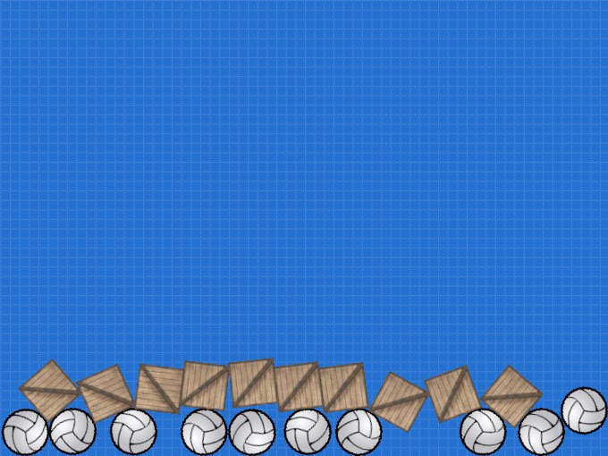
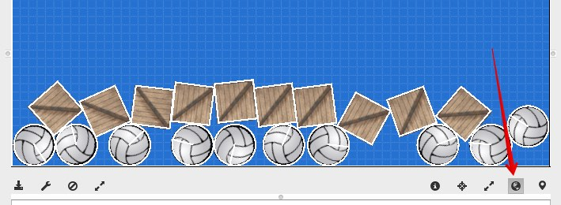
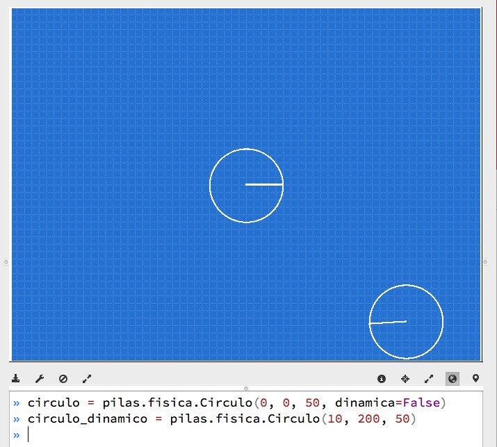

# Física

Pilas incluye integración con un sistema de física
para realizar simulaciones y dotar a tus juegos
de mas realismo y diversión.


## El motor: Box2D

El motor de física seleccionado para pilas se llama Box2D, el mismo
motor de física utilizado en el juego Angry Birds.

Así, Box2D y PyBox2D son las bibliotecas protagonistas
de casi toda la funcionalidad que vas a ver en este módulo.

El módulo `pilas.fisica` es solamente un facilitador para utilizar Box2D, y
que puedas comenzar a jugar con físicas rápidamente.

Así que aprovecho este espacio para dar las gracias a **Erin Catto**, y
su grupo de desarrollo por haber creado **Box2D**.


## Unos ejemplos

El motor de física se puede mostrar en funcionamiento
usando un ejemplo, escribe el siguiente código:

```
pelotas = pilas.actores.Pelota() * 10
```

esto creará un grupo de circunferencias que rebotarán
hasta la parte inferior de la pantalla.

De manera similar puedes crear un montón de cajas y
hacerlas rebotar:

```
cajas = pilas.actores.Caja() * 10
```

Como puedes ver, el resultado es un grupo caótico
de actores chocando entre sí. Mas adelante veremos
como personalizar y "controlar" un poco el escenario.


Los actores que tienen física son un poco particulares, pero
aún así se los puede tratar como a otros actores. Por
ejemplo, si quieres poder arrastrar y soltar figuras con
el mouse, puedes enseñarles una habilidad:

```
pelotas.aprender("arrastrable")
cajas.aprender("arrastrable")
```

## Modo depuración de física

Cuando haces juegos con física o movimientos realistas es
muy importante tener en cuenta un concepto importate:

Si bien uno observa pelotas y cajas, en realidad, internamente
son solo cuadrados y circunferencias.

Lo que ocurre en pantalla son dos cosas, por una lado vemos imágenes
con aspecto de caja o pelota, y por el otro se nos oculta una
simulación entre polígonos mucho mas primitiva y simple.

Observa esta escena:



Cada uno de esos actores está asociado a una figura
geométrica, la física en realidad se da en un nivel muy
primitivo de figuras. El aspecto de las cosas es
solo eso, un aspecto. Lo que "manda" en el comportamiento
físico son las figuras geométricas (cuerpos).

Intenta lo siguiente, pulsa la tecla **F11** o pulsá el
botón "mostrar figuras físicas" que aparece abajo a la
derecha:




Las lineas blancas indican polígonos que el
motor de física puede controlar, las cajas tienen forma
rectangular, los actores Pelota tienen figuras circulares, y
el suelo y las paredes también están en el sistema de física.

Si por algún motivo quieres que los objetos no estén contenidos
en la pantalla, y sean un poco mas libres, podrías eliminar
las paredes:

```
pilas.fisica.eliminar_paredes()
```

o incluso podrías eliminar el suelo:


```
pilas.fisica.eliminar_suelo()
```


Pero recuerda que los objetos que no se ven en la pantalla
de todas maneras estarán ahí. Una buena idea es eliminarlos
ni bien los dejas de usar.


## Física personalizada

Los actores `Pelota` y `Caja` están bien para simulaciones
simples y generales. Pero, ¿cómo podemos dotar a nuestros
propios actores de ese comportamiento?.

Los objetos o figuras físicas viven dentro del módulo de física
y son invisibles (al principio), pero luego se pueden vincular
a cualquier actor con facilidad.

Intenta lo siguiente, ingresa en el modo interactivo de pilas
y pulsa la tecla **F11** o pulsá el botón "mostrar figuras físicas" que
aparece abajo a la derecha:


Ahora creá dos figuras físicas, una circunferencia estática
y otra dinámica:

```
circulo = pilas.fisica.Circulo(0, 0, 50, dinamica=False)
circulo_dinamico = pilas.fisica.Circulo(10, 200, 50)
```

El primer círculo aparecerá en el centro de la ventana, y el
segundo comenzará en la posición ``(10, 200)``, es decir,
en la parte superior de la ventana y luego caerá
rebotando. Algo así:




Ahora bien, habrás notado que estas dos circunferencias las
podemos ver porque está habilitado el módulo de depuración (que
activamos con **F11**), pero esto no lo va a ver alguien que juegue
a nuestro juego. El modo depuración es solo para desarrolladores.

Lo que nos falta hacer, es darles apariencia a esas figuras. Algo
así como una piel..

Para esto podemos usar actores. La dinámica es así, tenemos que
crear dos actores, y luego decirle a estos actores que se comporten
cómo figuras geométricas.

Agreguemos a nuestro programa estas 4 lineas de código, queremos
que el primer circulo (el del centro) sea un mono, y el otro
círculo que sea una bomba:

```
mono = pilas.actores.Mono()
mono.aprender(pilas.habilidades.Imitar, circulo)

bomba = pilas.actores.Bomba()
bomba.aprender(pilas.habilidades.Imitar, circulo_dinamico)
```


Esto es diferente a lo anterior, los objetos físicos ahora
tienen apariencia:


Ahora podríamos desactivar el modo depuración física (pulsando
nuevamente **F11**) y jugar un poco impulsando la bomba de un
lado a otro:

```
circulo_dinamico.y = 200
```


Ten en cuenta que ahora la figura del motor físico es la
que determina el movimiento y la rotación, así que ya no
funcionará escribir algo cómo `bomba.y = 200`, ahora tienes
que escribir `circulo_dinamico.y = 200` para mover al actor...

Otra cosa a considerar, es que en nuestro ejemplo no ajustamos
muy bien el tamaño del `circulo_dinamico` con el de la
bomba. Esto es un detalle poco relevante aquí, porque solo
quiero explicar cómo se usa el motor, pero cuando hagas tus
juegos, recuerda usar el modo depuración de física para detectar
estos detalles y corregirlos, son muy importantes para que
tus usuarios disfruten del juego. Recuerda que ellos no
verán los círculos rojos... solo verán la apariencia
de los actores.


## Escala real y tamaño de figuras

Pilas utiliza una pantalla que se puede medir en pixels, de hecho, todas
las imágenes tienen un tamaño en pixels predefinido.

Pero dentro del mundo físico de box2d, las figuras no tienen tamaño en pixels
sino en metros.

¿Cual es la relación?, pilas convierte pixels a metros para mantener al mundo
de box2D en coherencia con lo que estamos viendo en pantalla.

30 pixels son equivalentes a 1 metro:


## Cambiando la gravedad interactivamente

Por defecto, la gravedad del escenario es de (0, -9), esto
significa que los objetos se dirigen hacia abajo, y lo hacen con
una aceleración de 90 mts/s^2 (metros sobre segundos cuadrados).

Pero no estás obligado a que esto sea siempre así, de hecho
si quieres hacer un juego que transcurra en el espacio seguramente
vas a querer eliminar por completo la gravedad del escenario
para que los objetos puedan "flotar", ¿no?.

Entonces, Podrías cambiar la gravedad en cualquier momento cambiando
los atributos ``gravedad_x`` o ``gravedad_y`` del objeto
``fisica`` así:

```
pilas.fisica.gravedad_x = 20
pilas.fisica.gravedad_y = 0
```

El atributo ``gravedad_x`` representará la aceleración horizontal, donde los
valores positivos acelerán los objetos hacia la derecha, y los valores
negativos a la izquierda.

De forma similar funciona el atributo ``gravedad_y``, los valores positivos
aceleran los objetos hacia arriba y los valores negativos hacia abajo.
