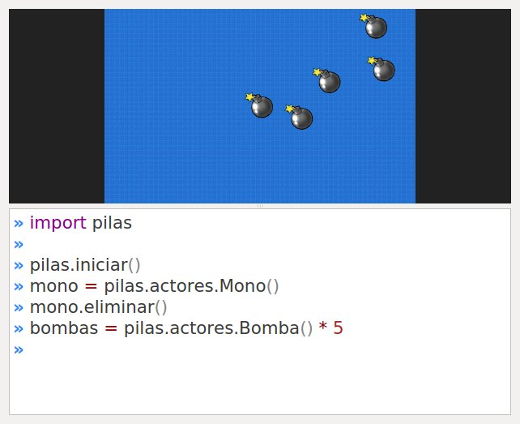
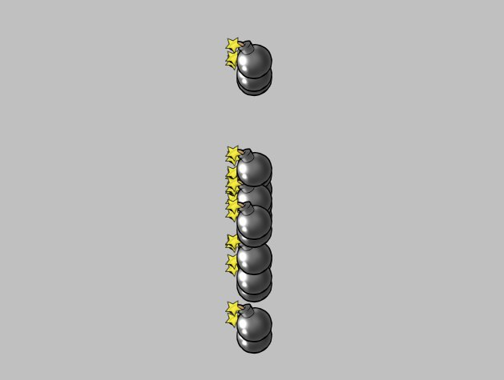
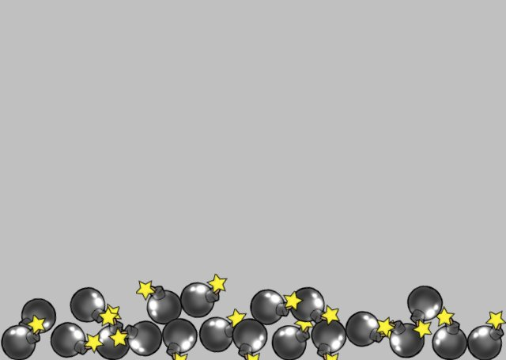
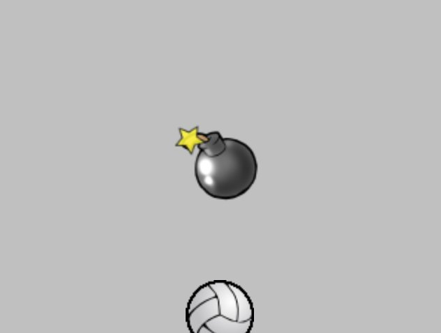

# Grupos

Ahora que podemos manejar a los actores de manera individual, vamos a ver como organizarlos en grupos.

Organizar a los actores en grupos es útil porque generalmente
buscamos clasificar a los actores por características y
tratarlos a todos por igual. Por ejemplo, en un juego de naves
podríamos tener un grupo de naves, un grupo de estrellas y un
grupo de disparos.

## Creando grupos de actores

Para crear varios actores de una misma clase
podríamos ejecutar algo como lo que sigue:

```
bombas = pilas.actores.Bomba() * 5
```

es decir, creamos un actor y luego lo multiplicamos
para construir un grupo con muchos actores de la misma
especie.

Al crear un grupo de esta forma, todos los actores
se colocarán en posiciones aleatorias.

Esto es lo que veríamos en la ventana de pilas:




A partir de ahora, la referencia `bombas` nos servirá para
controlar a todas las bombas al mismo tiempo.

Esta referencia (que llamamos `bombas`) es parecida a una lista de datos en `python`. Podríamos realizar operaciones típicas como contar, recorrer o clasificar de la misma forma que se hace en el lenguaje `python`.

Por ejemplo, para contar la cantidad de bombas que hemos creado y conocer sus coordenadas podemos ejecutar:

```python
>>> print "hay", len(bombas), "bombas"
hay 5 bombas

>>> for una_bomba in bombas:
...     print una_bomba.x, una_bomba.y
```

Ahora bien, algo que hace un poquito diferente a los
grupos de las listas de python, es que los grupos
te permiten alterar a varios actores al mismo tiempo
con mas facilidad.

Por ejemplo, imagina que quieres hacer que todas las
bombas aparezcan en el centro de la ventana. Podrías
hacer algo cómo esto:

```python
bombas.x = 0
```

Y en la ventana obtendremos:




Incluso, les podríamos enseñar a las bombas a reaccionar
como si fueran pelotas, es decir, que reboten e interactúen
con la aceleración gravitatoria:

```
bombas.aprender(pilas.habilidades.RebotarComoPelota)
```

Ahora tendrás algo mucho mas interesante, un montón de
actores rebotando entre sí:




Un consejo, la gravedad del escenario se puede modificar
usando una sentencia como la que sigue:

```
pilas.fisica.gravedad_x = 200
pilas.fisica.gravedad_y = 0
```

En este caso `gravedad_x` con un valor de 200 va a empujar los objetos
hacia la derecha de la pantalla, mientras que los objetos en el eje vertical
van a flotar.

Intentá ver esto en funcionamiento, ¡es divertido!

## Creando un grupo para distintos actores

Hay ocasiones, donde quieres tener un grupo
desde cero e ir agregando actores en él.

Esto se puede hacer fácilmente, e incluso
abre las puertas a que puedas mezclar actores
de distintas especies.

Para crear un grupo vacío tienes que crear
un objeto de la clase Grupo:

```
mi_grupo = pilas.grupo.Grupo()
```

y luego, para añadir actores al grupo puedes usar el
método ``agregar`` e indicar la referencia del actor
que quieres agregar:

```
bomba = pilas.actores.Bomba()
pelota = pilas.actores.Pelota()

mi_grupo.agregar(bomba)
mi_grupo.agregar(pelota)

mi_grupo.escala = [2]
```



Un detalle a tener en cuenta, el método ``agregar`` no solo te permite agregar actores, también podrías tomar un grupo y agregarle con algo como ``grupo.agregar(otro_grupo)``.
