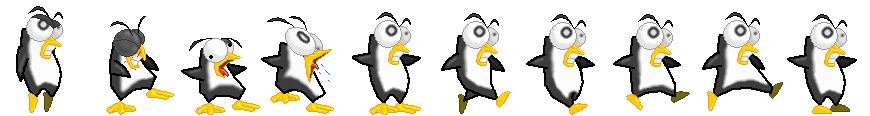
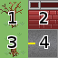

# Manejo de imágenes

En los videojuegos 2D las imágenes suelen estar en formatos
gráficos como **png** o **jpg** ya diseñados con anterioridad.

En `pilas` se pueden cargar estos recursos usando
el módulo `imagenes`. Por ejemplo, si tenemos una
imagen llamada `hola.png` podríamos incorporarla a
nuestro juego así:

```python
hola = pilas.imagenes.cargar('hola.png')
```

Las imágenes no se imprimen directamente en pantalla, en
su lugar tienes que crear un Actor y asignarle la
imagen.

Por ejemplo, el siguiente código muestra la imagen
en pantalla:

    imagen = pilas.imagenes.cargar("mi_personaje.png")
    actor = pilas.actores.Actor(imagen)

otra opción similar es crear al actor, y luego
asignarle la imagen:

    imagen = pilas.imagenes.cargar("mi_personaje.png")
    actor = pilas.actores.Actor()

    actor.imagen = imagen

Cualquiera de las dos opciones produce el mismo
resultado, personaje "cambiará" de apariencia
cuando se le asigne una nueva imagen.


## Imágenes de fondo

Muchas veces queremos que las imágenes cubran el fondo de pantalla
completamente, como si se tratara de un fondo o papel tapiz.

Si la imagen es suficientemente gránde para cubrir la pantalla, podemos
cargarla como una imagen normal y luego crear un fondo que la represente:

    fondo = pilas.fondos.Fondo()
    fondo.imagen = pilas.imagenes.cargar('mi_fondo.png')


Ahora, si en realidad queremos que el fondo se dibuje como si fuera un
mozaico (o papel tapiz), tenemos que indicarle a la imagen que se re-dibuje
muchas veces hasta cubrir el fondo de pantalla. El código es muy similar
al anterior, solo que ahora usamos las propiedades `repetir_horizontal` y
`repetir_vertical`

    fondo = pilas.fondos.Fondo()
    fondo.imagen = pilas.imagenes.cargar('mi_fondo.png')

    fondo.imagen.repetir_vertical = True
    fondo.imagen.repetir_horizontal = True

## Grillas de imágenes

Un forma conveniente de almacenar las imágenes de tus
personajes es usar una grilla.

La siguiente imagen es una grilla de 10 columnas
que utilizamos para crear al personaje "pingu":




Internamente la imagen se almacena así, pero a la
hora de mostrarse en pantalla se puede seleccionar
el cuadro.

Este es un ejemplo que carga la grilla de mas arriba
y genera un actor para mostrar el cuadro 1:


    actor = pilas.actores.Actor()
    grilla = pilas.imagenes.cargar_grilla("pingu.png", 10)
    actor.imagen = grilla

Ten en cuenta que el último argumento de la función ``pilas.imagenes.cargar_grilla`` es la cantidad de columnas que
tiene la grilla. También es posible usar funciones
que tengan filas y columnas, solo tendrías que indicar un
argumento mas con el número de filas. Lo veremos mas adelante.

Puedes ejecutar la siguiente sentencia para ver
la documentación completa de esta función:


    help(pilas.imagenes.cargar_grilla)


## Reproduciendo animaciones

Tener una grilla de imagenes es una buena
forma de comenzar a realizar animaciones.

Si quieres tomar una grilla y mostrar una
y otra vez sus cuadros podrías usar el actor Animación.

El siguiente código genera un actor que mostrará
uno a uno los cuadros de la grilla:


    grilla = pilas.imagenes.cargar_grilla("explosion.png", 7)
    p = pilas.actores.Animacion(grilla, True)

El actor `Animacion`, también puede recibir cómo argumento
la velocidad con la que tiene que reproducir la animación (medida
en cuadros por segundo).

El segundo argumento indica que la animación tiene que ser
cíclica (nunca termina).

Observa este ejemplo, muestra la misma animación de antes pero
mostrando un cuadro por segundo y se elimina cuando termina:


    grilla = pilas.imagenes.cargar_grilla("explosion.png", 7)
    p = pilas.actores.Animacion(grilla, False, velocidad=1)


## Animaciones controladas a mano con una grilla

Otra forma de hacer animaciones, es asociar una grilla
directamente a un actor y cambiar el cuadro a mostrar.

Por ejemplo, la siguiente sentencia avanza al siguiente
cuadro de animación en la grilla. Recuerda que
comienza en 1:


    grilla.avanzar()
    actor.imagen = grilla

Ten en cuenta que el método `avanzar` va a retornar `True` o `False`.
`True` significa que la grilla ha avanzado y ha mostrado un cuadro nuevo.
`False` significa que la grilla volvió a mostrar el primer cuadro.

Este valor de retorno es muy útil a la hora de
saber si una animación terminó, y poder tomar
alguna decisión al respecto.


## Grillas con filas y columnas

En el ejemplo anterior mencioné que las grillas pueden
tener filas y columnas. Esto se logra gracias a que
python permite tener funciones y métodos con argumentos
opcionales.

En este caso, la función ``cargar_grilla`` también
puede recibir la cantidad de filas que tiene una grilla:

    animacion = pilas.imagenes.cargar_grilla("grilla.png", 2, 2)

el primer número ``2`` indica que la grilla tiene dos
columnas y el segudo ``2`` indica que la grilla tiene dos
filas.


Cuando usas una grilla con pilas y columnas, la función ``avanzar``
que vimos antes va a recorriendo los cuadros de la misma
manera en que se lee una historieta (de izquierda
a derecha y de arriba a abajo).

Esta es la apariencia de la imágen que usamos antes y
los números indican el órden con que pilas leerá los cuadros:




## Haciendo animaciones sencillas

En muchas oportunidades nos interesa hacer animaciones simples
y que se repitan todo el tiempo sin mucho esfuerzo.

Con lo que vimos hasta ahora, hacer esas animación
es cuestión de cargar una grilla y llamar cada
un determinado tiempo a la función ``avanzar``.

Pero como esta es una tarea muy común, en **pilas** hay una forma
mas sencilla de hacer esto.

Existe un actor llamado ``Animación`` que tiene la
capacidad de mostrar una animación cíclica, es decir,
que se repita todo el tiempo, comenzando desde el principio
cuando llega al final.

Veamos un ejemplo, esta imagen tiene ``6`` cuadros de animación
ordenados en columnas:


Una forma sencilla de convertir esta animación en un actor
simple es crear la grilla, construir un actor ``Animacion`` e
indicarle a pilas que será una animación cíclica, es decir, que
se tendrá que repetir indefinidamente:


    grilla = pilas.imagenes.cargar_grilla("fuego.png", 6)
    actor = pilas.actores.Animacion(grilla, ciclica=True)


El resultado en la ventana será una animación de fuego que
no terminará nunca. Cuando el actor termine de mostrar el
cuadro 6 de la animación regresará al primero para comenzar
nuevamente.

Otra posibilidad es especificar el argumento ``ciclica=False``. En
ese caso el actor comenzará a mostrar la animación desde el cuadro
1 y cuanto termine eliminará al actor de la ventana. Esto es útil
para hacer efectos especiales, como explosiones o destellos, cosas
que quieres tener en la ventana un instante de tiempo y nada mas...


## Haciendo actores con animación

Puede que quieras hacer un actor que tenga múltiples animaciones, y
que las muestre en determinados momentos. Por ejemplo, si tienes
una nave con motores, es probable que quieras mostrar una animación
de motores en funcionamiento cuando la nave avanza y detener la
animación de motores cuando finaliza el movimiento.

Una forma de lograr esto de manera sencilla es crear tu propio
actor, y que este tenga dos atributos, uno para cada animación:


```python
class MiNave(pilasengine.actores.Actor):

    def iniciar(self, x=0, y=0):
        self.animacion_detenida = pilas.imagenes.cargar_grilla("nave_detenida.png", 1)
        self.animacion_movimiento = pilas.imagenes.cargar_grilla("nave_en_movimiento.png", 3)
```

Luego, en el método ``actualizar`` del propio actor podrías
avanzar la animación actual y permitirle al programador invocar
métodos para intercambiar animaciones:

```python
class MiNave(pilasengine.actores.Actor):

    # [...] codigo anterior

    def poner_en_movimiento(self):
        self.imagen = self.animacion_movimiento

    def poner_en_reposo(self):
        self.imagen = self.animacion_detenida

    def actualizar(self):
        self.imagen.avanzar()
```

Como puedes ver, el concepto inicial es el mismo, cuando
queremos cambiar de animación tenemos que cambiar de grilla, y
cuando queremos avanzar la animación solamente tenemos que
llamar al método ``avanzar``.

## Animaciones

Además de las imágenes y las grillas, pilas incluye un recurso llamado animación, que nos permite declarar y utilizar animaciones almacenadas en una grilla.

Por ejemplo, si tenemos una grilla con varios cuadros de animación como aquí:


podemos cargar la grilla completa y definir las dos
animaciones por separado.

Enumerando los cuadros de animación nos quedaría así:


y desde aquí podemos extraer dos animaciones:

- La animación que podemos armar con los cuadros ``0, 1, 4``:


- Y la animación que se puede armar con los cuadros ``3, 4, 5``:


Luego, para indicarle a *pilas* como interpretar las animaciones podemos
cargar la animación y especificar los cuadros:

```python
animacion = pilas.imagenes.cargar_animacion('alien.png', 5, 1)

animacion.definir_animacion('baja_palanca', [0, 1, 4], 10)
animacion.definir_animacion('parado', [3, 3, 3, 3, 4, 5, 4], 10)
```

Al llamar al método ``definir_animacion`` tenemos que especificar
en nombre de la animación, los cuadros a mostrar y luego la velocidad (medido
en cuadros por segundo.)

El siguiente paso es crear al actor e indicarle que animación mostrar en
cada momento:


```python

class MiActor(pilasengine.actores.Actor):

    def iniciar(self):

        # Las animaciones que cargamos antes:
        animacion = pilas.imagenes.cargar_animacion('alien.png', 5, 1)

        animacion.definir_animacion('baja_palanca', [0, 1, 4], 10)
        animacion.definir_animacion('parado', [3, 3, 3, 3, 4, 5, 4], 10)

        # Vinculamos la animación al actor
        self.imagen = animacion

        # Le indicamos que muestre la animación 'parado'
        self.imagen.cargar_animacion('parado')

    def actualizar(self):
        self.imagen.avanzar()


pilas.actores.vincular(MiActor)
mi_actor = pilas.actores.MiActor()
```


Es decir, con esta nueva clase, podremos representar
a nuestro actor y seleccionar cualquiera de las dos
animaciones que declaramos usando el método ``cargar_animacion``, que en este caso usamos para cargar
la animación ``parado``.
