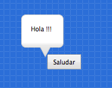
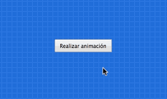
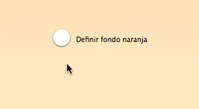
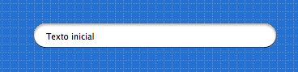
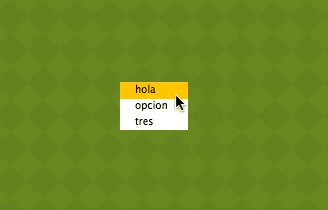

# Interfaz de usuario

Los componentes del módulo ``pilas.interfaz`` permiten crear botones, listas,
deslizadores y otros tipos de componentes visuales, todos orientados
a construir interfaces de usuario traducionales.


## Clase: Boton

Para crear un botón podemos instalar la clase `Boton` especificando
un texto.

```
boton = pilas.interfaz.Boton("Saludar")
```

y casi siempre vas a querer asignarle alguna acción cuando se hace
click sobre él, para eso necesitás una función y conectarla:

```
def saludar():
  boton.decir("Hola !!!")

boton.conectar(saludar)
```



Ten en cuenta que todos los objetos creados siguen siendo actores, así
que se pueden manipular como vimos antes: escalar, rotar, moverse etc...

#### Propiedades

* `texto`
* `icono`

#### Métodos

* `conectar(funcion)` - Conecta una función para responder al click de mouse.
* `ocultar()`
* `mostrar()`
* `deshabilitar()`
* `habilitar()`

#### Ejemplo de integración

Y para añadir una acción o respuesta al componente, podemos crear una
función y luego vincularla con el evento ``click``. Este ejemplo construye
un botón y realiza un movimiento cada vez que se hace click sobre él:

```
b = pilas.interfaz.Boton(u"Realizar animación")

def moverse():
    b.escala_x = [  2, 0.8, 1], 0.15
    b.escala_y = [0.8, 2,   1], 0.1
    d = pilas.azar(-50, 50)
    b.rotacion = [d, 1], 0.1

b.conectar(moverse)
```

El resultado en pantalla será así:





## Clase: Deslizador

El deslizador es útil para que el usuario pueda seleccionar
un valor intermedio entre dos números, por ejemplo entre 0 y 1, 0 y
100 etc.

Un ejemplo típico de este componente puedes encontrarlo
en las preferencias de audio de algún programa de sonido, los
deslizadores te permiten regular el grado de volumen.


Esta es una imagen del ejemplo ``deslizador.py`` que está
en el directorio ``ejemplos``. Tiene tres deslizadores, y
el usuario puede regular cualquiera de los tres para ver
los cambios en el actor:


Para construir un deslizador y asociarlo a una función
puedes escribir algo como esto:


```
def cuando_cambia(valor):
    print "El deslizador tiene grado:", valor

deslizador = pilas.interfaz.Deslizador()
deslizador.conectar(cuando_cambia)
```


Entonces, a medida que muevas el deslizador se imprimirán
en pantalla valores del 0 al 1, por ejemplo 0.25, 0.52777 etc...

Si quieres cambiar los valores iniciales y finales de la
escala de valores, lo mas sencillo es multiplicar el argumento
``valor`` de la función. Por ejemplo, si quieres valores entre
0 y 100:


```
def cuando_cambia(valor):
    valor_entre_cero_y_cien = valor * 100
```


#### Propiedades

* `progreso` - Almacen un valor entre 0 y 100

#### Métodos

* `conectar(funcion)` - Conecta una función que se llamará cada vez que muevas el deslizador.


## Clase: Selector

El selector te permite seleccionar una opción con
dos valores: habilitado, deshabilitado.

Se puede usar para opciones cómo habilitar o deshabilitar
el modo pantalla completa o algo así.

Para usarlo, se tiene que crear un objeto de la
clase ``Selector`` y un texto a mostrar:

```
selector = pilas.interfaz.Selector("Habilitar pantalla completa.")
```

Y luego, se puede consultar el valor del selector mediante el
atributo ``seleccionado``:

```
if selector.seleccionado:
    print "El selector esta seleccionado."
else:
    print "El selector no esta seleccionado."
```

aunque en lugar de consultar la variable, es mucho mejor asociarle
una función para que el selector la llame solamente cuando el
selector cambia de estado (seleccionado/deseleccionado):

```
def cuando_el_selector_cambia(estado):
    print "El selector ahora esta en estado:", estado

selector.definir_accion(cuando_el_selector_cambia)
```

#### Ejemplo de integración

Para mostrar el componente en funcionamiento tenemos un pequeño ejemplo: un
selector que nos permite alternar el fondo de la escena:

```
selector = pilas.interfaz.Selector("Definir fondo naranja")

def cambiar_el_fondo(ha_seleccionado):
    if ha_seleccionado:
        pilas.fondos.Tarde()
    else:
        pilas.fondos.Blanco()

selector.conectar(cambiar_el_fondo)
```

El resultado en pantalla será así:




#### Propiedades

* `texto` - Etiqueta que mostrará el deslizador
* `seleccionado` - Almacena True o False, indicando el estado de selección.

#### Métodos

* `conectar(funcion)` - Conecta una función que se llamará cada vez que muevas el deslizador.
* `alternar_seleccion()`
* `seleccionar()`
* `deseleccionar()`


## Clase: IngresoDeTexto

Si quieres solicitar datos, como el nombre del
usuario, puedes usar el objeto `IngresoDeTexto`. Ya que
muestra una caja y un pequeño cursor para
ingresar texto:




Para usar este componente tienes que crearlo y luego leer o escribir el
atributo `texto`, que contiene la cadena de texto de la caja:

```
entrada = pilas.interfaz.IngresoDeTexto()
entrada.texto = "Texto inicial"
```

Inicialmente, el objeto IngresoDeTexto toma un tamaño y apariencia predeterminado. Pero esto se puede cambiar fácilmente usando argumentos al momento de crear el componente.

Por ejemplo, podríamos enviarle cómo argumento un tamaño mas pequeño y un ícono de búsqueda:

entrada = pilas.interfaz.IngresoDeTexto(ancho=100, icono='iconos/lupa.png')
u otro ícono:

entrada = pilas.interfaz.IngresoDeTexto(ancho=100, icono='iconos/ok.png')
La caja también tiene otros métodos para permitir o prohibir el ingreso de datos.

Por ejemplo, podríamos decirle a la caja que solo permita el ingreso de números,
letras, o poner un límite de cantidad de caracteres. Los métodos
que te permite limitar el ingreso son `solo_numeros()` y `solo_letras()`, y el
límite de caracteres está en el atributo `limite_de_caracteres`:

#### Propiedades

* `texto`
* `icono`
* `limite_de_caracteres`

#### Métodos

* `cualquier_caracter()`
* `solo_numeros()`
* `solo_letras()`


## Clase: ListaSeleccion

La lista de selección se utiliza para mostrar al usuario una lista de cadenas, y permitirle seleccionarlas con el mouse.

Para crear un lista de selección, se tiene que crear una lista de cadenas y declarar una función para que sea llamada cuando se termina de seleccionar.

Por ejemplo, el siguiente código muestra una lista e imprime por consola cuando el usuario selecciona con el click del mouse:

```
def cuando_selecciona(opcion):
    print "Ha seleccionado la opcion:", opcion

consulta = pilas.interfaz.ListaSeleccion(['Uno', 'Dos', 'Tres'], cuando_selecciona)
```

#### Ejemplo de integración

Para mostrar el componente en funcionamiento, hacemos un lista de
tres opciones, y le conectamos una función para avisar la opción
que selecciona el usuario:

```
pilas.fondos.Pasto()

def cuando_selecciona(opcion_seleccionada):
    pilas.avisar("Ha seleccionado la opcion: " + opcion_seleccionada)

opciones = pilas.interfaz.ListaSeleccion(['hola', 'opcion', 'tres'], cuando_selecciona)
```

Deberías ver en pantalla lo siguiente:



