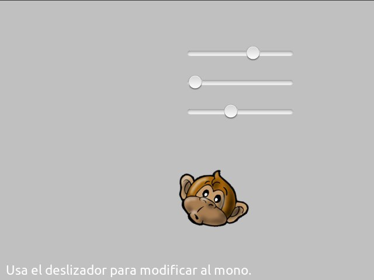

# Interfaz de usuario

Los componentes del módulo ``pilas.interfaz`` permiten crear botones, listas,
deslizadores y otros tipos de componentes visuales, todos orientados
a construir interfaces de usuario traducionales.


## Clase: Boton

Para crear un botón podemos instalar la clase `Boton` especificando
un texto.

```
boton = pilas.interface.Botón("Saludar")
```

y casi siempre vas a querer asignarle alguna acción cuando se hace
click sobre él, para eso necesitás una función y conectarla:

```
def saludar():
  boton.decir("Hola !!!")

boton.conectar(saludar)
```


Ten en cuenta que todos los objetos creados siguen siendo actores, así
que se pueden manipular como vimos antes: escalar, rotar, moverse etc...

#### Propiedades

* `texto`
* `icono`

#### Métodos

* `conectar(funcion)` - Conecta una función para responder al click de mouse.
* `ocultar()`
* `mostrar()`
* `deshabilitar()`
* `habilitar()`

#### Ejemplo de integración

Y para añadir una acción o respuesta al componente, podemos crear una
función y luego vincularla con el evento ``click``. Este ejemplo construye
un botón y realiza un movimiento cada vez que se hace click sobre él:

```
b = pilas.interfaz.Boton(u"Realizar animación")

def moverse():
    b.escala_x = [  2, 0.8, 1], 0.15
    b.escala_y = [0.8, 2,   1], 0.1
    d = pilas.azar(-50, 50)
    b.rotacion = [d, 1], 0.1

b.conectar(moverse)
```

El resultado en pantalla será así:


## Clase: Deslizador

El deslizador es útil para que el usuario pueda seleccionar
un valor intermedio entre dos números, por ejemplo entre 0 y 1, 0 y
100 etc.

Un ejemplo típico de este componente puedes encontrarlo
en las preferencias de audio de algún programa de sonido, los
deslizadores te permiten regular el grado de volumen.


Esta es una imagen del ejemplo ``deslizador.py`` que está
en el directorio ``ejemplos``. Tiene tres deslizadores, y
el usuario puede regular cualquiera de los tres para ver
los cambios en el actor:





Para construir un deslizador y asociarlo a una función
puedes escribir algo como esto:


```
def cuando_cambia(valor):
    print "El deslizador tiene grado:", valor

deslizador = pilas.interfaz.Deslizador()
deslizador.conectar(cuando_cambia)
```


Entonces, a medida que muevas el deslizador se imprimirán
en pantalla valores del 0 al 1, por ejemplo 0.25, 0.52777 etc...

Si quieres cambiar los valores iniciales y finales de la
escala de valores, lo mas sencillo es multiplicar el argumento
``valor`` de la función. Por ejemplo, si quieres valores entre
0 y 100:


```
def cuando_cambia(valor):
    valor_entre_cero_y_cien = valor * 100
```
