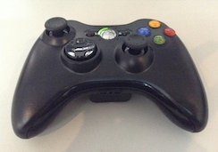

# Joystick

El soporte para joysticks nos permite controlar actores usando varios
modelos de mandos usb, por ejemplos los de **xbox** o similares:

## Obtener dispositivos conectados

El primer paso para obtener acceso a los joysticks es listar
los dispositivos conectados con la función `listar`. Por ejemplo
en este caso hay un solo mando usb conectado:

    » pilas.pad.listar()
    ['Wireless 360 Controller']

## Acceder a los controles

Cuando pilas-engine detecta el primer `joystick`, todos los eventos
que genera el `joystick` se almacenarán en el objeto `pilas.pad`. Así
que el acceso a las palancas o los botones se puede hacer directamente
desde ahí.

El control de posición analógico se puede acceder directamente con
las variables `x` e `y`

    » pilas.pad.x
    0
    » pilas.pad.y
    0

y si se pulsa el pad, las variables retornarán un valor entre `-1` y `1`
dependiendo del eje. En el siguiente caso, el movimiento indica que el pad
se movió para arriba a la derecha:

    » pilas.pad.x
    0.999123
    » pilas.pad.y
    1

## Acceso a eventos

También se puede acceder al joystick mediante eventos, para que pilas nos
informe el estado del control de forma mas directa.
