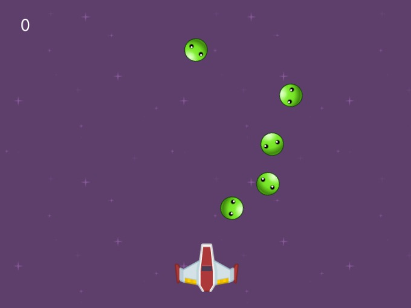
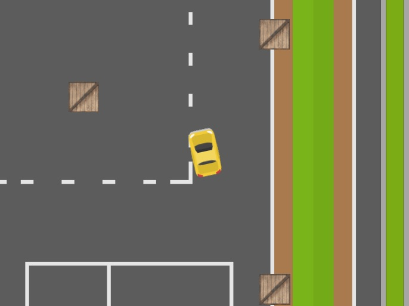
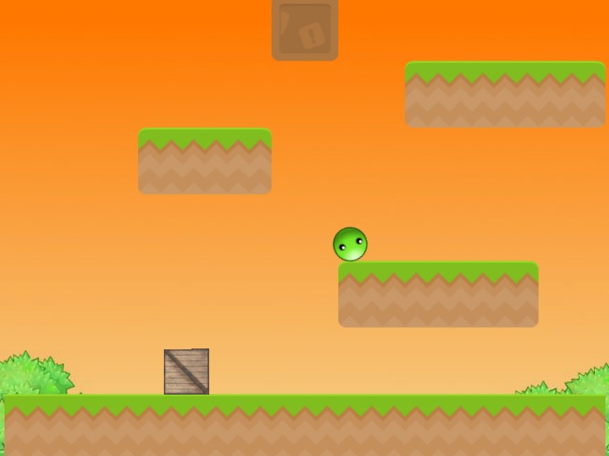
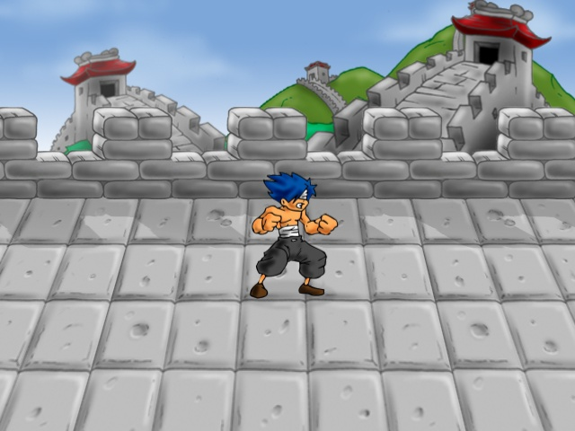

# ¿Qué tipos de juegos se pueden realizar?

Mediante pilas-engine se pueden hacer juegos en dos
dimensiones, utilizando colisiones, gráficos, efectos
de partículas y animación.

Por ejemplo, un juego sencillo de pilas podría verse así:

Incluso podemos usar las dos dimensiones para simular
una vista aérea.

y editar los niveles usando bloques para simular plataformas.

Por último un ejemplo más complejo de videojuego podría
incluir un suelo en perspectiva, para simular profundidad, como
en el juego **shaolin's blind fury**:

