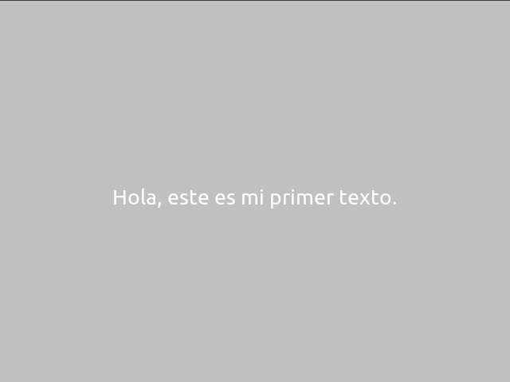

# Textos

Los objetos que muestran texto en pantalla se tratan de manera similar
a los actores. Por lo tanto, si ya sabes usar
actores, no tendrás problemas en usar cadenas
de texto.


## Crear cadenas de texto

El objeto que representa texto se llama ``Texto`` y
está dentro del modulo ``actores``.

Para crear un mensaje tienes que escribir:

```python
texto = pilas.actores.Texto("Hola, este es mi primer texto.")
```

y tu cadena de texto aparecerá en pantalla en color
negro y con un tamaño predeterminado:




Si quieres puedes escribir texto de varias lineas usando el caracter
``\n`` para indicar el salto de linea.

Por ejemplo, el siguiente código escribe el mismo mensaje de
arriba pero en dos lineas:


```python
texto = pilas.actores.Texto("Hola (en la primer linea)\n este es mi primer texto.")
```

## Los textos son actores

Al principio comenté que los textos también son actores, esto
significa que casi todo lo que puedes hacer con un actor
aquí también funciona, por ejemplo:


    texto.x = 100
    texto.escala = 2

incluso también funcionarán las interpolaciones:


    texto.rotacion = pilas.interpolar(360)


## Propiedades exclusivas de los textos

Existen varias propiedades que te permitirán alterar la
apariencia de los textos.

Esta es una lista de los mas importantes.

- color
- magnitud
- texto

Por ejemplo, para alterar el texto, color y tamaño de un
texto podría escribir algo así:


```python
texto.magnitud = 50
texto.color = pilas.colores.Color(0, 0, 0)   # Color negro
texto.color = pilas.colores.Color(255, 0, 0, 128)   # Color rojo, semi transparente.
texto.texto = "Hola, este texto \n tiene 2 lineas separadas"
```

## Mostrando mensajes en pantalla

Si bien podemos crear actores ``Texto`` y manipularlos como
quedarmos, hay una forma aún mas sencilla de imprimir mensajes
para los usuarios.

Existe una función llamada ``avisar`` que nos permite mostrar
en pantalla un texto pequeño en la esquina izquierda inferior
de la pantalla.

```python
pilas.avisar("Hola, esto es un mensaje.")
```

Esto te facilitará mucho el código en los programas
pequeños como demostraciones o ejemplos.
